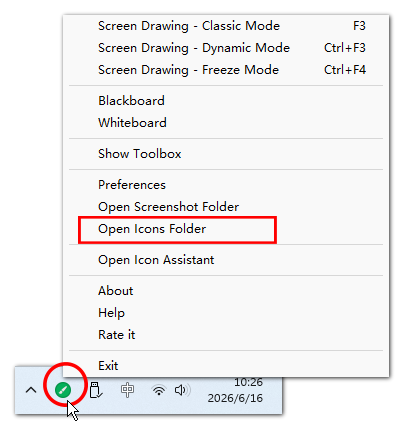
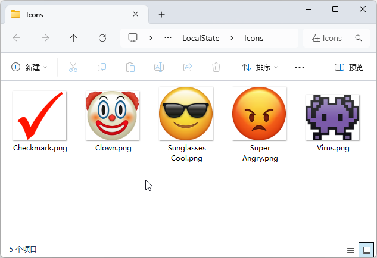
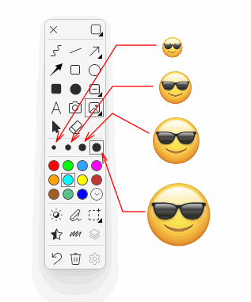
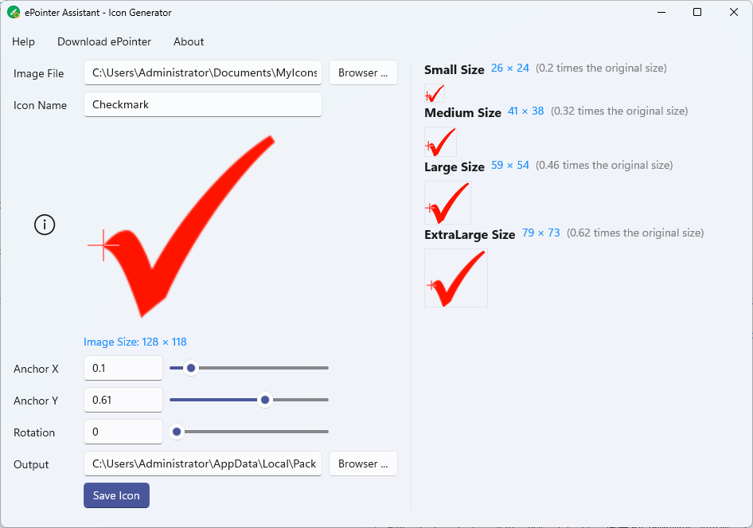

# ePointer Assistant Help

Related Software: [ePointer](/en/epointer.html), [ePointer Assistant](/en/epointer-assistant.html)

## How to Add Custom Icons to the ePointer?

### Simplest Steps

To import your own icons into the ePointer, the easiest way is to place the image files into the software's user icon directory. The specific operations are as follows:

1. **Open the User Icon Folder**: Launch the **ePointer** software, click the software icon in the system tray at the bottom right corner, and select [**Open Icon Folder**] from the pop-up menu. This will open the folder where the software stores user icons.
   

2. **Add Icon Files**: Copy your own icon files (images in `.png` format) to the icon folder to add new icons.
   

   > Tip: There is no need to close the software when adding new icons. However, if you need to delete or replace old icon files and receive a error prompt, please close the software and try again.

3. **Delete Icons**: Delete the image files in the icon folder to remove the corresponding icons.

   > Tip: If a deletion error prompt appears when deleting, please close the ePointer software first.

4. **Use Icons in the ePointer**: In drawing mode, open the drop-down panel of the **Icon** tool, and you will see the newly installed icons.
   
   
   > Tip: If there are too many icons that exceed the capacity of the panel, you can move the mouse over the panel and scroll the middle mouse button to scroll the panel.

### Icon Size

The size of the software's built-in icons is 128*128 pixels. You can refer to this size to create your own icons.

Different brush sizes will affect the size of the icon drawn on the screen. The specific correspondence is as follows:

| Brush Size | Drawn Icon Size |
| ---------- | --------------- |
| Small Brush | 20% of the original size |
| Medium Brush | 32% of the original size |
| Large Brush | 46% of the original size |
| Extra-Large Brush | 62% of the original size |

For example, if the original size of an icon image is `128*128` pixels, the size of the icon drawn with a small brush will be `26*26` pixels, and with a medium brush it will be `41*41` pixels, and so on. If you use a larger or smaller image, the drawn icon will be correspondingly larger or smaller with different brush sizes.

## Problems Solved by the ePointer Assistant

Since you only need to copy images to the specified icon directory to use them in the *Screen Electronic Pointer*, why do you need the *ePointer Assistant*?

This involves the issue of icon anchor point.

By default, the anchor point of an icon is at the top-left corner (as shown in the left image above). When drawing an icon in the ePointer, the mouse click position will align with the top-left corner of the icon. However, this may not be what we want. For example, take a checkmark: we usually want the left endpoint of the checkmark to align with the mouse position (as shown in the right image above), so that we can easily predict where the checkmark will appear on the annotated target. In such cases, we need to set the icon's anchor point, and this is where the ePointer Assistant is needed.

## How to Use the ePointer Assistant

The ePointer Assistant is used to help you set the anchor point and rotation angle of icons.

The usage steps are as follows:

1. **Select Image File**: Click the [**Browse**] button to open the image file to be used as an icon. Supports `.png` format and transparent backgrounds.

2. **Set Image Name**: Set the image name in the [**Image Name**] text box. This name will also be used as the file name of the icon, and the default is the file name of the image file.

3. **Set Icon Anchor Point**: You can directly click the mouse or press and drag the mouse in the original image display box below the *Image Name* to set the icon's anchor point. You can also adjust the anchor point by modifying the [**Anchor X**] and [**Anchor Y**]. The crosshair represents the position of the anchor point. The anchor point position is where the mouse aligns when drawing.

4. **Adjust Rotation Angle**: If needed, you can also rotate the icon.

5. **Preview Icon**: The right side of the interface displays the actual drawn size and display effect of the icon with different brush sizes. The crosshair represents the position where the ePointer aligns the mouse when drawing the icon.

6. **Set Output Directory**: Set the output directory for saving the icon files.

   > Tip: You can directly set the output directory to the user icon folder (right-click the ePointer icon in the system tray and select [**Open Icons Folder**] to get the path), which can omit the subsequent icon installation steps. However, it should be noted that if you want to overwrite an existing icon, it may result in saving errors due to the original icon being in use. In this case, you need to first turn off the ePointer.

7. **Save Icon**: After clicking this button, the software will automatically copy the icon file to the output directory and generate a configuration file (a `.ini` file with the same name) for the icon.

8. **Install Icon**: Similar to the icon installation method introduced above, copy both the image file and the `.ini` file in the output directory to the user icon folder.