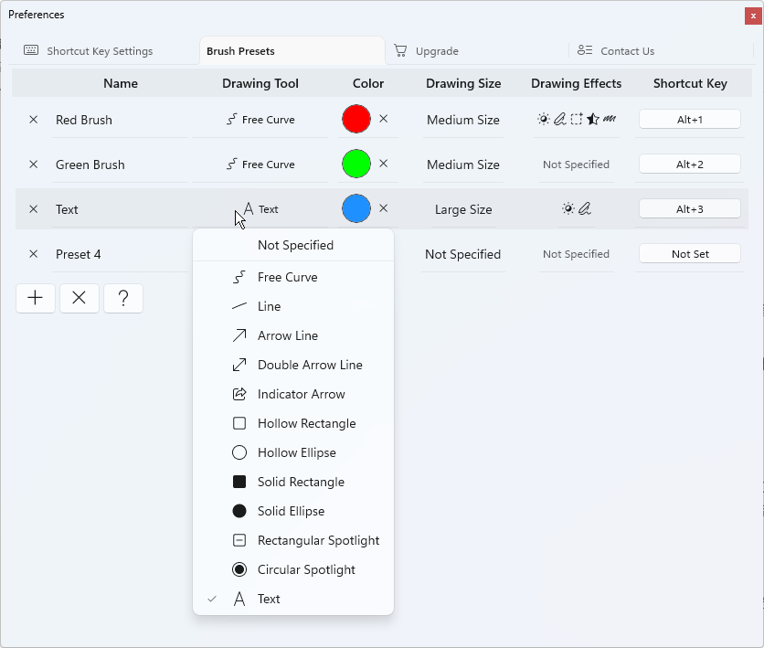

# ePointer Brush Presets Help

Brush presets allow you to combine your frequently used drawing tools, colors, sizes and effects. You can quickly switch between them via hotkeys, eliminating tedious manual configuration on the toolbar.

When editing a preset, if you set any item (brush tool, color, size, effect) to `Not Specified`, the software will automatically adopt the corresponding live parameters currently set on the toolbar.

- Click the `+` button to add a new brush preset; click the `X` button to delete all presets in the list.
- **Name cell:** Click the cell to rename the preset.
- **Drawing Tool Cell:** Click the cell to change the drawing tool. If unspecified, the currently selected brush tool on the toolbar will be used.
- **Color cell:** Click the cell to adjust the drawing color. Click the `X` icon next to the color to clear the color setting. If no color is specified, the active color on the toolbar applies.
- **Drawing Size cell:** Click the cell to modify the drawing size. When unspecified, the current drawing size from the toolbar is retained.
- **Drawing Effects cell:** Click the cell to configure one or multiple brush effects for the preset. If no effects are assigned, whatever effects are enabled on the toolbar will be used.
- **Shortcut Key cell:** Click the cell to record a custom shortcut key for the preset. While in drawing mode, pressing this hotkey loads all saved configurations, activating the matched brush tool, size, color and effects instantly.