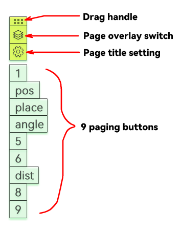

The paginator is displayed along the left edge of the screen and consists of 13 components from top to bottom: drag handle, page overlay switch, page title setting button, nine page buttons, and a help button at the bottom. The help button automatically hides after the help panel is opened once. If you need to access the help panel later, click the Page Label Setting Button; there is another help button inside the settings interface.

## Drag Handle
The paginator snaps to the left edge of the screen every time it appears. Drag the drag handle to move the paginator to any position. When the handle gets close to the left or right screen edge, it will automatically snap to the nearest edge.
Double-click the drag handle to collapse all other buttons; double-click again to restore them.

## Nine Page Buttons
The nine page buttons correspond to nine independent pages with no mutual interference. You may draw different annotations on each page. Click these buttons to switch between pages.

## Page Overlay Switch
Pages are independent by default. To display multiple pages stacked together, activate this toggle to turn it blue.
Click the page buttons you want to overlay one by one; they will turn purple to indicate they are enabled for overlay. Click again to disable overlay for the page.

Note: The last activated page button will turn dark purple, marking its corresponding page as the **current drawing page**. Any shapes drawn on the canvas will belong to this page.

You can switch the current drawing page by either right-clicking a page button or clicking a page button while holding the Ctrl key.

Note: When pages are overlaid, pages positioned higher in the stacking order will be covered by pages positioned lower.

## Page Title Setting Button
Page buttons show numerical labels by default, which may lack intuitive meaning. Use the Page Label Setting Button to assign descriptive custom labels to each page button. Labels will be fully displayed on the buttons; it is recommended to keep labels concise.

## Save Page Annotations
Right-click the canvas and select Save Page Annotations to export all graphic data from every page as a single package. You can use Load Page Annotations later to restore the saved drawings.