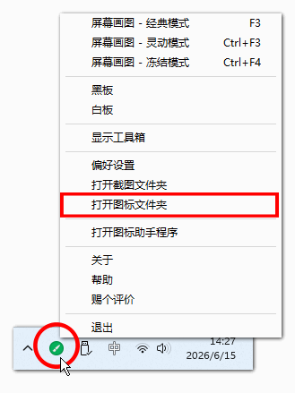
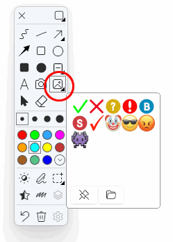
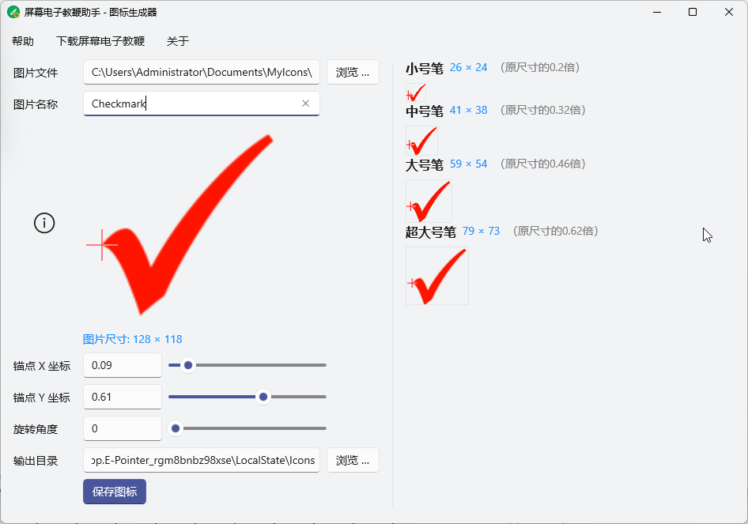

# 屏幕电子教鞭助手使用帮助

相关软件：[屏幕电子教鞭](/zh-hans/epointer.html)、[屏幕电子教鞭助手](/zh-hans/epointer-assistant.html)

## 如何在屏幕电子教鞭中增加自定义的图标？

### 最简单的步骤

要在屏幕电子教鞭中导入自已的图标，最简单的方式就是将图片文件放到软件的用户图标目录中。具体操作下如下：

1. **打开用户图标文件夹：** 启动 **屏幕电子教鞭** 软件，单击右下角系统托盘中的屏幕电子教鞭软件图标，在弹出的菜单中点击【**打开图标文件夹**】，会打开软件用于存储用户图标的文件夹。
   

2. **添加图标文件：** 将自己的图标文件（`.png`格式的图片）复制到图标文件夹中，即可增加新图标。
   

   > 提示：增加新的图标无需关闭软件，但如果需要删除或替换旧图标文件，如果提示无法删除，则需要关闭软件后重试。

3. **删除图标：** 删除图标文件夹中的图片文件，即可删除对应图标。

   > 提示：如果删除时提示无法删除，请先关闭电子屏幕教鞭软件。

4. **在屏幕电子教鞭中使用图标：** 在绘图模式下，点开**图标**工具的下拉面板，就可以看到新安装的图标了。
   

   > 提示：如果图标很多，超出面板可以容纳的数量，可以将鼠标移动到面板上，滚动鼠标中键来滚动面板。

### 图标的尺寸

软件内置的图标尺寸为`128*128`，单位：`像素`，你可以参考这个尺寸来制作自己的图标。

不同的画笔尺寸，会影响图标绘制到屏幕后的尺寸大小，具体对应情况如下：

| 画笔尺寸 | 图标绘制尺寸  |
| -------- | ------------- |
| 小号笔   | 原图尺寸的20% |
| 中号笔   | 原图尺寸的32% |
| 大号笔   | 原图尺寸的46% |
| 超大号笔 | 原图尺寸的62% |

比如，如果图标的原始图片尺寸为`128*128`（像素），那么用小号笔画出来的图标尺寸为`26*26`（像素），中号笔画出来的图标尺寸为`41*41`，以此类推。如果你使用更大或更小的图片，那么在不同的画笔尺寸下，绘制出来的图标相应的也会更大或更小。

## 屏幕电子教鞭助手要解决的问题

既然只需要将图片复制到指定的图标目录，就能在 *屏幕电子教鞭* 中使用图标，那为什么还要 *屏幕电子教鞭助手* 呢？

这涉及图标锚点的问题。

默认情况下，图标的锚点在左上角（如上图左图），在屏幕电子教鞭中绘制图标时，鼠标点击的位置会对准图标的左上角。但这可能不是我们想要的，比如以对勾为例，我们通常希望，将对勾的左端点对准鼠标的位置（如上图右图），这样可以很容易的预测对勾将出现在批注目标上的位置。这种情况下就要设置图标的锚点，这时就需要用到屏幕电子教鞭助手了。

## 屏幕电子教鞭助手的使用方法

屏幕电子教鞭助手的作用就是帮助你设置图标的锚点和旋转角度。

使用方法如下：

1. **选择图片文件：** 点击【**浏览**】按钮打开要用作图标的图片文件，支持`.png`格式，支持透明背景。

2. **设置图片名称：** 在【**图片名称**】文本框中设置图片名称，该名称也将用作图标的文件名，默认使用图片文件的文件名。

3. **设置图标的锚点：** 你可以直接在 *图片名称* 下方的原图显示框中点击鼠标或按下并拖动鼠标，设置图标的锚点，也可以通过调节【**锚点X坐标**】和【**锚点Y坐标**】来调整锚点，十字星代表锚点的位置。锚点的位置，就是在绘图时，鼠标对准的位置。

4. **调整旋转角度：** 如果有需要，你也可以对图标进行旋转。

5. **预览图标：** 在界面右侧显示了不同的画笔尺寸下图标的实际绘制尺寸和显示效果，十字星代表屏幕电子教鞭在绘制该图标时，鼠标对准的位置。

6. **设置输出目录：** 设置用于保存图标文件的输出目录。

   > 提示：可以直接将输出目录设置到用户图标文件夹下（右键单击屏幕电子教鞭在系统托盘中的图标，点击【**打开图标文件夹**】即可获得该路径），这样可以省略后面的图标安装步骤。不过要注意，如果要覆盖现有图标，可能会因为原图标正在使用而导致保存出错，这种情况下要先关闭屏幕电子教鞭。

7. **保存图标：** 点击该按钮后软件会自动将图标文件复制到输出目录，并生成图标的配置文件（同名的`.ini`文件）。

8. **安装图标：** 和上文介绍的安装图标类似，将输出目录中的图片文件和`.ini`文件都复制到用户图标文件夹下即可。

