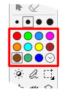
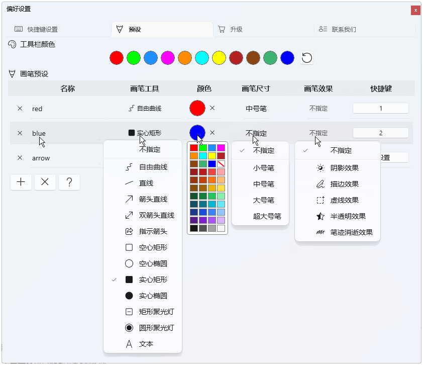
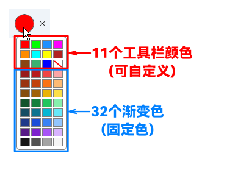

# 屏幕电子教鞭颜色和画笔预设帮助

我们可以在软件的偏好设置中重新设置工具栏上显示的画笔颜色，以及进行画笔预设。

画笔预设可以将常用的画笔工具、颜色、尺寸、效果进行组合，使用快捷键快速切换，从而省去在工具栏中繁琐的配置。

点击工具栏右下角的齿轮按钮，打开软件的【偏好设置 - 预设】界面，这里就可以定义工具栏上的画笔颜色和预设画笔。

## 工具栏颜色

工具栏颜色指的是直接显示在工具栏颜色区的画笔颜色，我们可以在偏好设置中根据自己需要重新设置这些颜色。

macOS版和Windows版在颜色定义上有一些细微差别。

### macOS版

macOS版的工具栏颜色可自定义24个。工具栏默认显示12个颜色（第一页），按住option键后会显示另外12个颜色（第二页），您可以在预设界面重新定义这24个颜色。

==（图）==

点击色块后会弹出颜色选择对话框，可以通过点选或输入色值（如RGB、Hex等）来设置颜色。

==（图）==

### Windows版

Windows版的工具栏颜色可自定义11个。Windows版简化了工具栏颜色，默认提供了11个颜色，但通过弹出面板额外提供了32个渐变颜色，使用【更多颜色】按钮还可以通过颜色选择面板使用几乎所有颜色，但只有直接显示在工具栏上的11个颜色允许自定义。

点击颜色会弹出颜色面板，点击【更多颜色】会弹出颜色选择对话框，可以通过点选或输入色值（如RGB、Hex等）来设置颜色。

==（图）==

## 画笔预设

在编辑预设时，包括画笔工具、颜色、尺寸、效果，如果设置成`不指定`，则会自动套用工具栏上实时设置的相应参数。

==mac图==

+ 点击`+`号按钮新增一个预设画笔；点击`X`按钮删除表格中的所有预设。
+ **`名称`单元格：** 点击单元格可以修改预设的名称。
+ **`画笔工具`单元格：** 点击单元格可以修改预设中使用的画笔工具；如果不指定画笔工具，则使用工具栏上选中的画笔工具。
+ **`颜色`单元格：** 点击单元格可以修改预设中使用的画笔颜色；点击颜色后面的`X`按钮清除颜色；如果不指定颜色，则使用工具栏上选中的颜色。
+ **`画笔尺寸`单元格：** 点击单元格可以修改预设中使用的画笔尺寸；如果不指定画笔尺寸，则使用工具栏上选中的画笔尺寸。
+ **`画笔效果`单元格：** 点击单元格可以修改预设中使用的效果，效果可以设置一个或多个；如果不指定画笔效果，则使用工具栏上选中的效果。
+ **`快捷键`单元格：** 点击单元格可以录制预设的快捷键；在画图模式下，使用该快捷键可以将预设中的配置应用到工具栏，从而激活相应的画笔工具、尺寸、颜色和效果。

## 画笔预设中的颜色和工具栏颜色的关联性

需要注意的是，画笔预设中的颜色它不是独立的，它是与您自定义的工具栏颜色关联的，当工具栏颜色修改了色值，那与该颜色关联的画笔预设中的画笔颜色也会自动改变。

不过，对于Windows版有例外的情况。因为Windows版在供画笔预设挑选颜色时，不仅提供了11个可自定义的工具栏颜色，还额外提供了32个渐变色，这32个颜色是固定的，不可改变。当您选择的颜色是32个固定色中的一个时，那么修改11个工具栏颜色的色值不变对画笔预设中的颜色造成影响。

