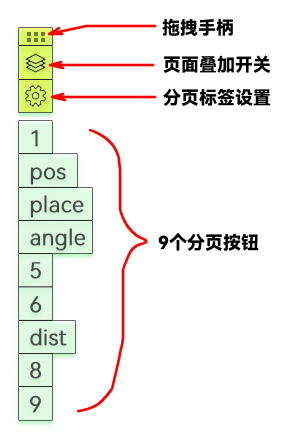

分页器显示在屏幕左侧边缘，从上到下共有13个组件，分别是：拖拽手柄、页面叠加开关、分页标签设置按钮、9个分页按钮和最后一个帮助按钮。帮助按钮在打开一次帮助后会自动隐藏，如果之后再想打开帮助，可以点击 *分页标签设置按钮* 按钮，设置界面有另一个帮助按钮。

## 拖拽手柄

分页器每次显示时都会吸附到屏幕的左侧边缘。拖动拖拽手柄可以将分页器拖动到任何位置，当手柄贴近屏幕的左、右边缘时，它会自动吸附到接近的屏幕边缘。

双击拖拽手柄可以收拢其它按钮，再次双击即可恢复展示。

## 九个分页按钮

九个分页按钮对应于九个独立的页面，每个页面互相独立，互不影响，您可以在不同的页面中标注不同的内容。点击这些分页按钮可以切换到不同的页面。

## 页面叠加开关

页面原本是互相独立的，如果需要将不同的页面叠加显示，可以激活该按钮，使之成为蓝色。

依次点击需要叠加显示的分页按钮，使之成为紫色，即可激活该页面进行叠加；再次单击，即可取消叠加。

注意，最后一个激活的分页按钮会呈暗紫色，表示它所对应的页面是**当前画图页**，也就是说，如果现在在画板上画图，那么所画的图形就会属于该分页按钮所对应的页面。

我们可以通过 **右键单击** 或 **按住Ctrl键单击** 分页按钮来改变当前画图页。

注意，页面叠加时，排序在上的页面会被排序在下的页面覆盖。

## 分页标签设置按钮

分页按钮的标签默认显示为数字，代表的含义可能不够直观，此时您可以使用 *分页标签设置按钮* 按钮为各个分页按钮设置有意义的标签。标签会完整显示在分页按钮上，建议标签不要太长。

## 保存分页图形

右键单击画板，可以使用【保存分页标注】按钮来打包导出各个页面的中的图形数据，下次可以使用【加载分页标注】来加载。