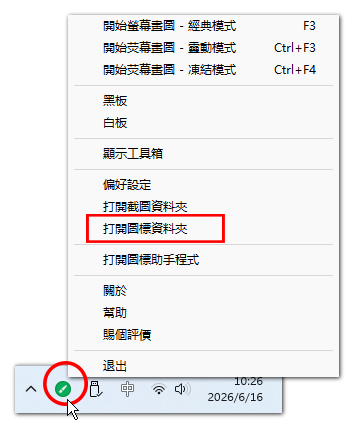
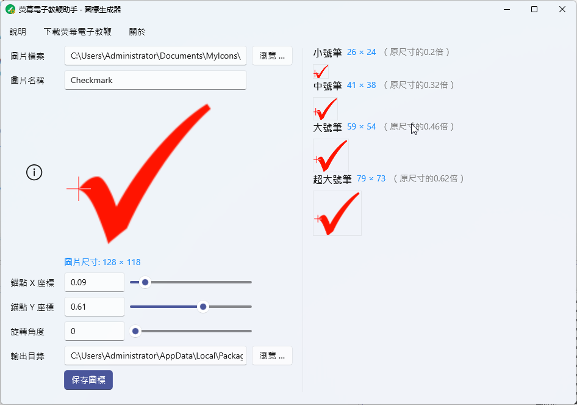

# 螢幕電子教鞭助手使用說明

相關軟體：[螢幕電子教鞭](/zh-hant/epointer.html)、[螢幕電子教鞭助手](/zh-hant/epointer-assistant.html)

## 如何在螢幕電子教鞭中新增自訂圖示？

### 最簡易的步驟

若要在螢幕電子教鞭中匯入自訂圖示，最簡單的方式就是將圖片檔案放置到軟體的使用者圖示目錄中。具體操作如下：

1. **開啟使用者圖示資料夾：** 啟動 **螢幕電子教鞭** 軟體，點擊右下角系統匣中的螢幕電子教鞭軟體圖示，在彈出的選單中點選【**打開圖標資料夾**】，即可開啟軟體用於儲存使用者圖示的資料夾。
   

2. **新增圖示檔案：** 將自訂的圖示檔案（`.png`格式的圖片）複製到圖示資料夾中，即可新增圖示。
   

   > 提示：新增圖示無需關閉軟體，但若需刪除或替換舊圖示檔案，若出現無法刪除的提示，請先關閉軟體後再嘗試。

3. **刪除圖示：** 刪除圖示資料夾中的圖片檔案，即可移除對應的圖示。

   > 提示：若刪除時出現無法刪除的提示，請先關閉螢幕電子教鞭軟體。

4. **在螢幕電子教鞭中使用圖示：** 於繪圖模式下，開啟**圖示**工具的下拉面板，即可看到新安裝的圖示。
   
   
   > 提示：如果圖標很多，超出面板可以容納的數量，可以將滑鼠移動到面板上，滾動滑鼠中鍵來滾動面板。

### 圖示的尺寸

軟體內建的圖示尺寸為128*128（單位：像素），您可參考此尺寸製作自訂圖示。

不同的畫筆尺寸，會影響圖示繪製到螢幕後的尺寸大小，具體對應關係如下：

| 畫筆尺寸 | 圖示繪製尺寸  |
| -------- | ------------- |
| 小號筆   | 原圖尺寸的20% |
| 中號筆   | 原圖尺寸的32% |
| 大號筆   | 原圖尺寸的46% |
| 超大號筆 | 原圖尺寸的62% |

舉例來說，若圖示的原始圖片尺寸為`128*128`（像素），則使用小號筆繪製出的圖示尺寸為`26*26`（像素），中號筆繪製出的尺寸為`41*41`，依此類推。若您使用更大或更小的圖片，則在不同畫筆尺寸下，繪製出的圖示尺寸也會對應增大或縮小。

## 螢幕電子教鞭助手要解決的問題

既然只需將圖片複製到指定的圖示目錄，就能在 *螢幕電子教鞭* 中使用圖示，為何還需要 *螢幕電子教鞭助手* 呢？

這涉及到圖示錨點的問題。

預設情況下，圖示的錨點位於左上角（如上圖左圖），在螢幕電子教鞭中繪製圖示時，滑鼠點擊的位置會對齊圖示的左上角。但這可能不符合使用需求，例如以對勾為例，我們通常希望將對勾的左端點對齊滑鼠位置（如上圖右圖），如此便能輕易預測對勾會出現在註解目標上的位置。此時就需要設定圖示的錨點，而這就需要用到螢幕電子教鞭助手。

## 螢幕電子教鞭助手的使用方法

螢幕電子教鞭助手的作用是協助您設定圖示的錨點與旋轉角度。

使用方法如下：

1. **選擇圖片檔案：** 點擊【**瀏覽**】按鈕開啟要做為圖示的圖片檔案，支援`.png`格式，且支援透明背景。

2. **設定圖片名稱：** 在【**圖片名稱**】文字方塊中設定圖片名稱，該名稱也將做為圖示的檔案名稱，預設使用圖片檔案的檔名。

3. **設定圖示的錨點：** 您可直接在 *圖片名稱* 下方的原圖顯示框中點擊滑鼠，或按住滑鼠拖曳，來設定圖示的錨點；也可透過調整【錨點X座標】與【錨點Y座標】來微調錨點位置，十字星符號代表錨點所在位置。錨點的位置，即為繪圖時滑鼠對齊的位置。

4. **調整旋轉角度：** 若有需要，您也可對圖示進行旋轉調整。

5. **預覽圖示：** 介面右側顯示了不同畫筆尺寸下，圖示的實際繪製尺寸與顯示效果，十字星符號代表螢幕電子教鞭繪製該圖示時滑鼠對齊的位置。

6. **設定輸出目錄：** 設定用於儲存圖示檔案的輸出目錄。

   > 提示：可直接將輸出目錄設定為使用者圖示資料夾（滑鼠右鍵點擊系統匣中的螢幕電子教鞭圖示，點選【開啟圖示資料夾】即可取得該路徑），如此可省略後續的圖示安裝步驟。不過要注意，如果要覆蓋現有圖標，可能會因為原圖標正在使用而導致保存出錯，這種情況下要先關閉荧幕電子教鞭。

7. **儲存圖示：** 點擊此按鈕後，軟體會自動將圖示檔案複製到輸出目錄，並生成圖示的設定檔（同名的`.ini`檔案）。

8. **安裝圖示：** 與前文介紹的圖示安裝方式類似，將輸出目錄中的圖片檔案與`.ini`檔案一同複製到使用者圖示資料夾即可。