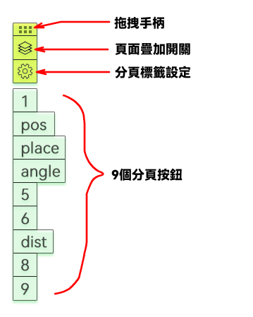

# 螢幕電子教鞭分頁器使用說明

分頁器顯示於畫面左側邊緣，由上至下共計13個元件，分別為：拖曳把手、頁面重疊開關、分頁標籤設定按鈕、9個分頁按鈕，以及最下方的說明按鈕。說明按鈕開啟一次說明頁面後會自動隱藏，若後續需要再次開啟說明，可點擊「分頁標籤設定按鈕」，設定介面內另有一組說明按鈕。

## 拖曳手柄
分頁器每次彈出時都會自動吸附至畫面左側邊緣。拖曳把手可將分頁器移動至任意位置，當把手靠近畫面左、右邊緣時，會自動吸附至鄰近的畫面邊緣。
雙擊拖曳把手可收合其餘所有按鈕，再次雙擊即可恢復顯示。

## 九個分頁按鈕
九個分頁按鈕分別對應九個獨立頁面，各頁面互不影響，你可在不同頁面標註相異內容。點擊分頁按鈕即可切換頁面。

## 頁面疊加開關
預設狀態下各頁面互相獨立，若需同時疊顯多個頁面，請啟用此開關，開關會變為藍色。
依序點擊欲疊顯的分頁按鈕，按鈕會轉為紫色，代表該頁面開啟疊顯；再次點擊即可取消疊顯。

注意：最後啟用的分頁按鈕會呈深紫色，代表該頁面為**當前繪圖頁**，也就是現在於畫板上繪製的圖形，都會歸屬於此分頁按鈕對應的頁面。

可透過**滑鼠右鍵點擊**或是**按住Ctrl鍵點擊**分頁按鈕，切換當前繪圖頁。

注意：頁面疊顯時，堆疊順序上方的頁面會被下方頁面覆蓋。

## 分頁標籤設定按鈕
分頁按鈕預設顯示數字標籤，辨識度較低，此時可使用「分頁標籤設定按鈕」為各分頁按鈕設定易讀的自訂標籤。標籤會完整顯示於按鈕上，建議標籤文字不宜過長。

## 儲存分頁標註
於畫板上按滑鼠右鍵，點選【儲存分頁標註】可打包匯出所有頁面的圖形資料，後續可透過【載入分頁標註】還原標註內容。